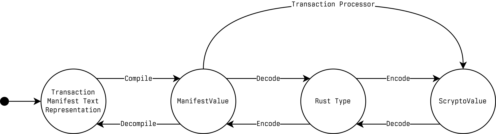
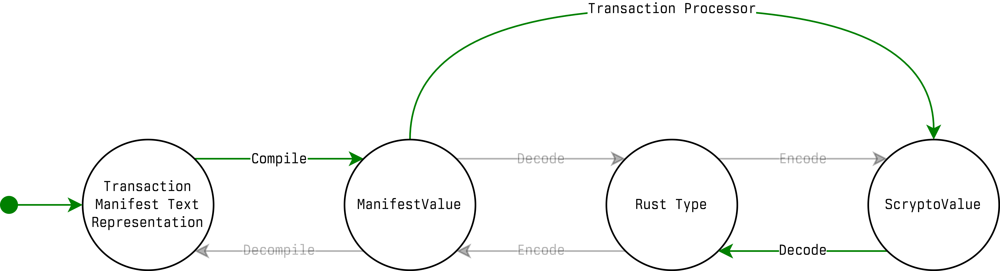
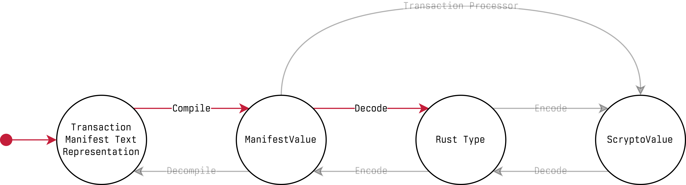

# Scrypto v1.3.1

## Support For New Rust Compilers

### Why This Was Needed

Until now, Scrypto packages had to be compiled with Rust **1.81.0 or older**. Newer Rust versions emit WASM binaries that can include non-MVP WebAssembly features, most notably instructions from the **bulk memory** proposal—which the Radix Engine does not permit.

A natural idea is to force the compiler to stick to MVP WASM by using `-Ctarget-cpu=mvp`. Unfortunately, that only applies to *your crate’s code*. The prebuilt Rust standard library distributed for the `wasm32-unknown-unknown` target may still include non-MVP instructions, and your package is linked against that standard library. The end result is a WASM artifact that can still contain instructions rejected by the Radix Engine, due to the standard library. An extensive write-up on this issue can be found [here](https://github.com/radixdlt/radixdlt-scrypto/pull/2079).

With this Scrypto release, you can use Rust versions **newer than 1.81.0**. We’ve tested these changes with **Rust 1.92.0**, and in principle any newer compiler version should work as well.

### What Changed

We updated the Scrypto build pipeline so the Rust standard library is rebuilt **as part of every Scrypto package build**. This gives us full control over which WASM features appear in the final artifact, including those originating from the standard library. The pipeline changes are:

-   **`RUSTC_BOOTSTRAP=1` is set** when compiling Scrypto packages. This allows rebuilding the Rust standard library using the stable compiler the user has installed (more information [here](https://doc.rust-lang.org/beta/unstable-book/compiler-environment-variables/RUSTC_BOOTSTRAP.html)).
    
-   The Scrypto compiler now sets `CARGO_ENCODED_RUSTFLAGS`, `RUSTFLAGS`, and `CARGO_TARGET_WASM32_UNKNOWN_UNKNOWN_RUSTFLAGS` to `-Ctarget-cpu=mvp -Ctarget-feature=+mutable-globals,+sign-ext -Zunstable-options -Cpanic=abort`. This forces the final WASM artifact to use the MVP feature set, while explicitly permitting `mutable-globals` and `sign-ext`.
    
-   The Scrypto compiler now sets `CFLAGS_wasm32_unknown_unknown` to `-mcpu=mvp -mmutable-globals -msign-ext`. This is especially important for packages that depend on crates containing C code (for example `minicov`), ensuring `clang` does not generate WASM instructions we don’t permit.
    
-   The Scrypto compiler now instructs Rust to rebuild the standard library by passing `-Zbuild-std=std,panic_abort` and `-Zbuild-std-features=optimize_for_size`.
    

### What This Means For You

You should now be able to use Rust versions **above 1.81.0**, including the **Rust 2024 edition**, without hitting publish-time failures due to rejected WASM instructions. The Scrypto codebase currently uses **Rust 1.92.0** in CI, toolchain files, and in newly generated packages.

**One important note:** if you use a **custom build pipeline** (i.e., you do not use `scrypto build` or the `ScryptoCompiler`), this is a **breaking change** for you. Building a valid Scrypto WASM is no longer equivalent to a simple `cargo build --release --target wasm32-unknown-unknown`. In most cases, you must also ensure the output uses MVP WASM features (plus the small set of features we consider safe), which typically requires rebuilding the Rust standard library for the `wasm32-unknown-unknown` target as part of the build.

## New Manifest SBOR Types

### Why This Was Needed

To understand the need for this we need to take a deep dive into how the data flows throughout the Radix Engine. The following is a *rough* state machine of the various states that the data can exist in and how various data transformations are performed.



Let’s now say that you have the following argument in a manifest, which is equivalent to a `rule!(require(named_address))` which is a an access rule that requires a named address:

```plainText
Enum<2u8>(  
    Enum<0u8>(  
        Enum<0u8>(  
            Enum<1u8>(  
                NamedAddress("some\_address")  
            )  
        )  
    )  
)
```

When this data is flowing through the Radix Engine it takes the following path through the above state machine:



The data starts out in the textual transaction manifest representation. The manifest compiler then compiles it into a `ManifestValue` and eventually that makes its way to the transaction processor. Not all value types in the Manifest SBOR codec are compatible with the Scrypto SBOR codec. For example, Scrypto SBOR doesn’t have a concept of a `NamedAddress`, only static addresses, but the Manifest SBOR codec does. This means that translating a `ManifestValue` into a `ScryptoValue` can’t be done without the use of some context. A `NamedAddress` requires the context of the transaction to understand which address reservation it’s linked to and what static address was allocated as a result of the allocation instruction. The transaction processor tracks the transaction’s context and is therefore capable of taking a named address (or other types that require conversion) and converting it into the appropriate `ScryptoValue`. Once the `ManifestValue` has been converted into a `ScryptoValue` by the transaction processor it can then be SBOR decoded into its appropriate Rust type, which is an `AccessRule` in this case.

This is the **core reason** as to why an `AccessRule` that contains a `NamedAddress` can be used in a transaction, and that transaction can be executed successfully, despite the `AccessRule` models not supporting named addresses.

However, there are certain cases where the data that we have might not take the same flow as described above. Let’s use the manifest’s static analyzer as an example which decodes all of the native blueprint invocations found in the manifest to analyze the manifest and determine its static validity. For the same example textual manifest input provided above, the state machine diagram for it would look like the following:



The data would start out in its textual manifest representation and will then be compiled by the manifest compiler into a `ManifestValue` which is fed into the static analyzer. The static analyzer would then attempt to decode this `ManifestValue` into its appropriate Rust type, which is an `AccessRule` in this case, but fail since the `AccessRule` model doesn’t support `NamedAddress`es. The static analyzer would then, ***incorrectly***, flag this manifest as being statically invalid despite the fact that if it were submitted to the ledger it would execute successfully.

The core of this issue is that certain native blueprint invocation types implemented the Manifest SBOR codec but they didn’t use models that could express the full range of data types that can be expressed in that codec, and therefore, the decoding fails in the static analyzer, but doesn’t fail when it goes through the transaction processor.

As evident by the description of this issue, the impact of it can’t be felt on-ledger and is only felt off-ledger by static analyzers and tools that attempt to process the invocations found in manifests, like the Radix Engine Toolkit or the wallet for example.

### What Changed

We introduced new models that implement the Manifest SBOR codec and changed all of the Manifest SBOR invocation types of the native blueprints to use these models. These models have the following properties:

-   They’re opaque at the language layer (in Rust), this means that for these new types you can’t inspect at the data that they contain.
-   They’re fully typed in the SBOR layer, this means that they implement the same SBOR schema as the Scrypto SBOR types that they mirror.
-   They’re completely immutable.

The list of new Manifest SBOR types added is:

-   `ManifestPackageDefinition`
    
-   `ManifestBasicRequirement`
    
-   `ManifestCompositeRequirement`
    
-   `ManifestAccessRule`
    
-   `ManifestOwnerRole`
    
-   `ManifestMetadataValue`
    

As we’ve already mentioned, these types are completely opaque at the language layer. Therefore, we have implemented the following to make it easier to work with these types, we will use `AccessRule` as an example here, but this applies to all of the types above:

-   An `AccessRule` can be converted into a `ManifestAccessRule` through the `ManifestAccessRule::new` function which takes in an `AccessRule` or through Rust’s `From` trait. This is useful when building manifests if the user wants to continue using the old models and do the conversion into the new models at the end.
    
-   A `ManifestAccessRule` can be converted back into an `AccessRule` through the `ManifestAccessRule::try_into_typed` method or through Rust’s `TryFrom` trait. As the name of the method suggests, this is a fallible conversion which would fail if the contained data can’t be converted into the `AccessRule` type. This is useful when analyzing manifests and wanting to peek into these opaque types.
    

With these new added models, we changed a number of the invocation types to use the correct Manifest SBOR models. The changes are as follows:

| **Blueprint Name** | **Struct Name** | **Field Name** |  |  |
| --- | --- | --- | --- | --- |
| **Old Type** | **New Type** |  |  |  |
| `AccessController` | `AccessControllerCreateManifestInput` | `rule_set` | `RuleSet` | `ManifestRuleSet` |
| ​ | `AccessControllerInitiateRecoveryAsPrimaryManifestInput` | `rule_set` | `RuleSet` | `ManifestRuleSet` |
| ​ | `AccessControllerInitiateRecoveryAsRecoveryManifestInput` | `rule_set` | `RuleSet` | `ManifestRuleSet` |
| ​ | `AccessControllerQuickConfirmPrimaryRoleRecoveryProposalManifestInput` | `rule_set` | `RuleSet` | `ManifestRuleSet` |
| ​ | `AccessControllerQuickConfirmRecoveryRoleRecoveryProposalManifestInput` | `rule_set` | `RuleSet` | `ManifestRuleSet` |
| ​ | `AccessControllerTimedConfirmRecoveryManifestInput` | `rule_set` | `RuleSet` | `ManifestRuleSet` |
| ​ | `AccessControllerStopTimedRecoveryManifestInput` | `rule_set` | `RuleSet` | `ManifestRuleSet` |
| `Account` | `AccountCreateAdvancedManifestInput` | `owner_role` | `OwnerRole` | `ManifestOwnerRole` |
| `Identity` | `IdentityCreateAdvancedManifestInput` | `owner_role` | `OwnerRole` | `ManifestOwnerRole` |
| `AccountLocker` | `AccountLockerInstantiateManifestInput` | `owner_role` | `OwnerRole` | `ManifestOwnerRole` |
| ​ | ​ | `storer_role` | `AccessRule` | `ManifestAccessRule` |
| ​ | ​ | `storer_updater_role` | `AccessRule` | `ManifestAccessRule` |
| ​ | ​ | `recoverer_role` | `AccessRule` | `ManifestAccessRule` |
| ​ | ​ | `recoverer_updater_role` | `AccessRule` | `ManifestAccessRule` |
| `Package` | `PackagePublishWasmManifestInput` | `definition` | `PackageDefinition` | `ManifestPackageDefinition` |
| ​ | `PackagePublishWasmAdvancedManifestInput` | `owner_role` | `OwnerRole` | `ManifestOwnerRole` |
| ​ | ​ | `definition` | `PackageDefinition` | `ManifestPackageDefinition` |
| ​ | `PackagePublishNativeManifestInput` | `definition` | `PackageDefinition` | `ManifestPackageDefinition` |
| `OneResourcePool` | `OneResourcePoolInstantiateManifestInput` | `owner_role` | `OwnerRole` | `ManifestOwnerRole` |
| ​ | ​ | `pool_manager` | `AccessRule` | `ManifestAccessRule` |
| `TwoResourcePool` | `TwoResourcePoolInstantiateManifestInput` | `owner_role` | `OwnerRole` | `ManifestOwnerRole` |
| ​ | ​ | `pool_manager` | `AccessRule` | `ManifestAccessRule` |
| `MultiResourcePool` | `MultiResourcePoolInstantiateManifestInput` | `owner_role` | `OwnerRole` | `ManifestOwnerRole` |
| ​ | ​ | `pool_manager` | `AccessRule` | `ManifestAccessRule` |
| `FungibleResourceManager` | `FungibleResourceManagerCreateManifestInput` | `owner_role` | `OwnerRole` | `ManifestOwnerRole` |
| ​ | ​ | `resource_roles` | `FungibleResourceRoles` | `ManifestFungibleResourceRoles` |
| ​ | `FungibleResourceManagerCreateWithInitialSupplyManifestInput` | `owner_role` | `OwnerRole` | `ManifestOwnerRole` |
| ​ | ​ | `resource_roles` | `FungibleResourceRoles` | `ManifestFungibleResourceRoles` |
| `NonFungibleResourceManager` | `NonFungibleResourceManagerCreateManifestInput` | `owner_role` | `OwnerRole` | `ManifestOwnerRole` |
| ​ | ​ | `resource_roles` | `NonFungibleResourceRoles` | `ManifestNonFungibleResourceRoles` |
| ​ | `NonFungibleResourceManagerCreateWithInitialSupplyManifestInput` | `owner_role` | `OwnerRole` | `ManifestOwnerRole` |
| ​ | ​ | `resource_roles` | `NonFungibleResourceRoles` | `ManifestNonFungibleResourceRoles` |
| ​ | `NonFungibleResourceManagerCreateRuidWithInitialSupplyManifestInput` | `owner_role` | `OwnerRole` | `ManifestOwnerRole` |
| ​ | ​ | `resource_roles` | `NonFungibleResourceRoles` | `ManifestNonFungibleResourceRoles` |
| `Metadata` | `MetadataSetManifestInput` | `value` | `MetadataValue` | `ManifestMetadataValue` |
| `RoleAssignment` | `RoleAssignmentCreateManifestInput` | `owner_role` | `OwnerRoleEntry` | `ManifestOwnerRoleEntry` |
| ​ | `RoleAssignmentSetManifestInput` | `rule` | `AccessRule` | `ManifestAccessRule` |
| ​ | `RoleAssignmentSetOwnerManifestInput` | `rule` | `AccessRule` | `ManifestAccessRule` |

Some of the manifest invocation types for the native blueprints have had their `ManifestSBOR` trait implementations removed with only `ManifestEncode` and `ManifestCategorize` kept. This only applies to types that can’t capture the full range of values that the Manifest SBOR codec allows for.

### What This Means For You

If you’re a user of the `ManifestBuilder` or if you author your manifests in the textual formats then these changes do not affect you in any way and you should be able to build your manifests in the same way as you did before without *much* changes.

If you made use of the `*ManifestInput` types then you would be affected by this change and would notice that some of the fields on your `*ManifestInput` structs have incorrect types. This can mostly be solved by calling `.into()` on these fields since, as mentioned above, these new opaque types allow for conversions through Rust’s `From` trait.

## Miscellaneous Changes

-   Fixed an issue where packages wouldn’t compile due to an issue with CMAKE.
    
-   Improved the Scrypto logging macros to work better with IDEs.
    
-   Added support for non-fungible resources in the receipt’s execution trace.
    
-   Changed the separator used in SBOR’s `categorize_types` attribute to `;`.
    
-   Fixed bugs with the `TypedManifestNativeInvocation` type that caused decoding to fail in cases when it should not.
    
-   Added more native invocations to the `TypedManifestNativeInvocation` to ensure that it supports all of the invocations on the native blueprints.